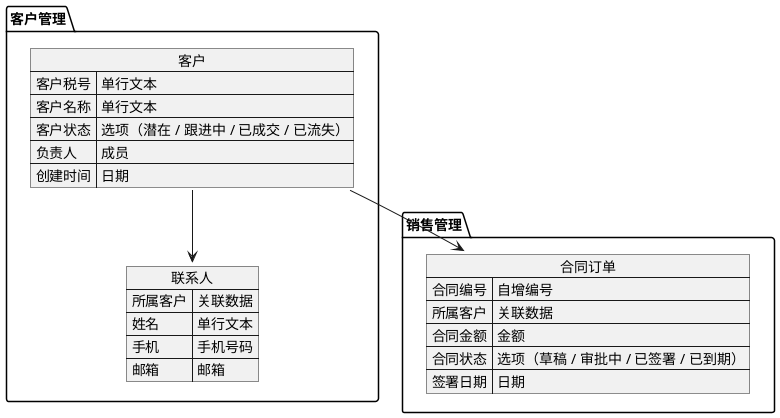

# hb-er-draw

生成兼容飞书画板的 PlantUML ER 表结构图，适配伙伴云零代码平台的字段类型体系。

## 功能

- 根据业务描述或字段列表生成 PlantUML ER 图代码
- 自动渲染 PNG 预览图（通过 PlantUML 官方服务器）
- 输出可直接粘贴到飞书画板的代码

## 使用场景

当用户说"画 ER 图"、"画表结构图"、"画数据库关系图"、"生成飞书 ER 图"，或提供业务模块、字段列表、数据库结构时触发。

## 规范

### 字段类型

类型统一用中文，对应伙伴云零代码平台字段：

| 类型 | 适用场景 |
|---|---|
| 关联数据 | 关联另一张表的记录（外键） |
| 单行文本 | 名称、编号等简短内容 |
| 多行文本 | 备注、描述等长文本 |
| 富文本 | 带排版的说明文档 |
| 选项（A / B / C） | 枚举值，选项写在括号内用 / 分隔 |
| 日期 | 创建时间、签署日期等 |
| 时间 | 仅记录时刻 |
| 成员 | 负责人、审批人等系统用户 |
| 金额 | 合同金额、预估金额等 |
| 数值 | 数量、折扣率等纯数字 |
| 开关 | 布尔值 |
| 自增编号 | 需要独立编号以便引用或追溯时使用 |
| 评分 | 星级评价 |
| 进度条 | 百分比进度 |
| 手机号码 | 手机，支持格式校验 |
| 邮箱 | 邮箱地址，支持格式校验 |
| 附件 | 文件附件 |
| 图片 | 图片文件 |
| 位置 | GPS 定位坐标 |
| 地址 | 文字形式的地址 |
| 手写签名 | 需要手写签字的场景 |
| 扫码 | 条形码/二维码 |

### 业务主键

伙伴云平台自动生成系统数据 ID，ER 图只画业务主键：

- 有意义的字段优先（如客户税号、统一社会信用代码）
- 需要独立编号时用 `自增编号`（如合同编号、工单编号）
- 无业务主键需求的表不画 ID 字段（如联系人、跟进记录）

### 1-n 关联规范

N 表必须有一个 `关联数据` 字段，命名为 **所属xx**（xx 为父表名）：

```
json 联系人 {
  "所属客户": "关联数据",
  "姓名": "单行文本"
}
```

### 共享选项

同一组选项被多张表引用时，抽取为配置表，引用方改用 `关联数据`。配置表不在 ER 图中显示为实体。

## 示例



## 渲染脚本

`scripts/plantuml_render.py` 通过 PlantUML 官方服务器将 `.puml` 文件渲染为 PNG，无需本地安装 Java 或 Graphviz。

```bash
python3 scripts/plantuml_render.py input.puml output.png
```
